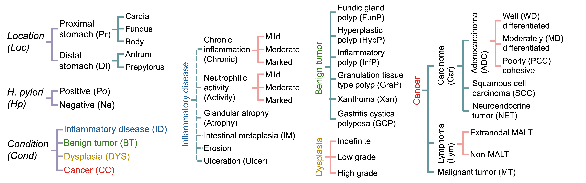

# 🧬 GastUJB: Large-Scale Gastric Pathology Dataset


**GastUJB** is a large-scale, internally curated gastric whole slide image dataset collected at the **Catholic University of Korea Uijeongbu St. Mary’s Hospital** between 2014 and 2023.

It is designed to serve as a primary cohort for defining diagnostic taxonomies and evaluating fine-grained computational pathology tasks. The dataset features comprehensive coverage of gastric diagnostic categories with hierarchical labeling.

---

## 📊 Dataset Overview

### Key Features
* **Scale:** Contains a total of **12,079** Whole Slide Images (WSIs).
* **Real-World Data:** Reflects routine clinical practice, covering a wide spectrum of diagnostic categories.
* **Hierarchical Labels:** Supports multi-level diagnostic tasks (fine-grained evaluation).
* **Robust Evaluation:** The train/test split strictly ensures **patient-level independence** to prevent data leakage.

### Data Partitioning
The dataset is partitioned into training and testing sets. While we do not enforce equal class ratios (to reflect natural clinical prevalence), the split is designed to prevent excessive class imbalance while preserving the cohort's overall distribution.

| Dataset Split | Slide Count ($N$) | Description |
| :--- | :--- | :--- |
| **GastUJB-Train** | $6,913$ | Primary training set for model development. |
| **GastUJB-Test** | $5,166$ | Held-out test set for validation and benchmarking. |
| **Total** | **$12,079$** | All de-identified slides. |

---

## 📂 Taxonomy & Labels
GastUJB covers a comprehensive range of gastric pathology categories. It serves as the primary cohort for defining the study's diagnostic taxonomy. The labels are organized hierarchically to allow for 


---

## 📥 Access & Usage

### 1. Requesting the Data
Access to the **GastUJB** dataset is available upon request. To obtain the dataset, researchers must sign a data usage agreement.

Please send an email to the contact listed below with the following details:
* **Subject:** Request for GastUJB Dataset Access
* **Body:** Please include your name, institution, and a brief description of how the data will be used.

### 2. Data Structure
Once access is granted, the dataset is organized as follows:

```text
GastUJB/
├── 2014/
│   ├── 2014_process
│     ├── coordinates
│     ├── mask
│     └── ...
│   ├── 2014_raw
│     ├── slide_100
│       ├── data_1.dat
│       ├── data_2.dat
│       └── ...
│     └── ...
├── 2023/
│   ├── 2023
│     ├── slide_100
│     └── ...
│   └── ...
└── clinical_metadata.csv
```
## Contact
**Email:** <a href="mailto:khangnq@korea.ac.kr?subject=Request%20for%20GastUJB%20Dataset%20Access">khangnq@korea.ac.kr</a>
